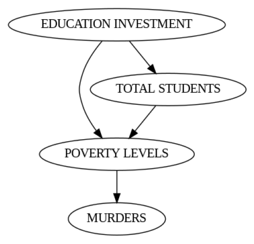
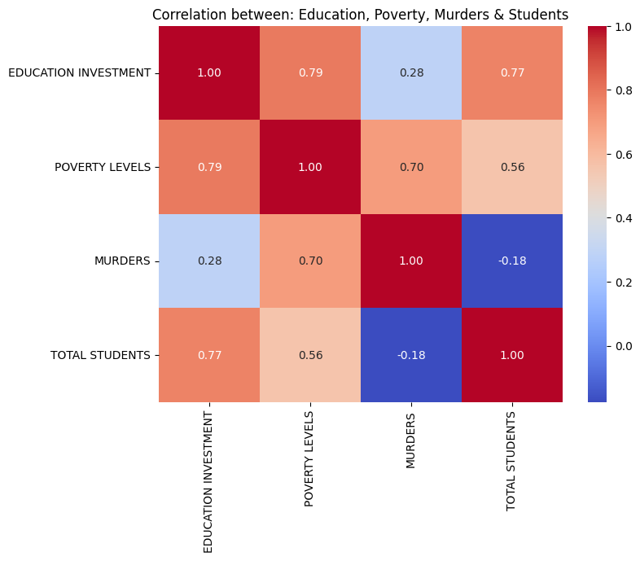

# The Interplay Between Poverty, Education and Crime in Ecuador

*By: Angel Munoz*

## Executive Summary
This project addresses the issue of crime in Ecuador, aiming to understand the relationship between poverty, education, and insecurity. Using open data from various government sources, the analysis seeks to provide a clear view of how the lack of investment in education might be contributing to the rise in crime, especially in areas with high poverty levels.

The project is based on the premise that improving education in the most disadvantaged regions can have a positive impact on reducing crime. Through data analysis and the creation of visualizations, the project will offer evidence-based recommendations for public policy.

[Read detailed background information here](Background.md)

## Key Performance Indicators (KPIs)
Here are the 5 KPIs that will be used to measure the impact of poverty and education on crime rates:

### 1. Crime Rate by Province:
- Provides direct insight into where crime is most prevalent, allowing policymakers and community leaders to identify hotspots of insecurity. By comparing crime statistics across different provinces, stakeholders can correlate high crime regions with other factors such as poverty levels and inadequate education funding. Consequently, this measure not only highlights the immediate challenges in public safety but also serves as a starting point for deeper investigations into underlying issues.

  #### 1.1 Homicides by Province
  - Homicide rates by province provide a clear picture of violent crime distribution across Ecuador. Tracking these numbers annually from 2019 to 2024 helps identify trends, regional disparities, and potential links to socioeconomic factors like poverty and education investment. Understanding these patterns enables policymakers to implement targeted crime prevention strategies.

  - **Technical Detail:**
    * Frequency: Anually
    * Range: Whole number, between 0 and 10,000.
    * Time Period: 2019-2024

  #### 1.2 Prisioners by Province
  - The number of people detained by the justice system in each province provides insight into law enforcement activity and judicial trends. Analyzing this data for 2024-2025 helps identify regions with higher detention rates and their possible connection to crime, security, and justice policies. This information is essential for assessing the effectiveness of the judicial system and exploring preventive measures.
    
  - **Technical Detail:**
    * Frequency: Anually
    * Range: Whole number, between 51 and 14,616.
    * Time Period: 2024-2025

### 2. Poverty due to Unsatisfied Basic Needs:
- Provides a comprehensive measure of deprivation by analyzing the percentage of people living in poverty based on essential living conditions. By breaking the data down into national, urban, and rural sectors, it highlights disparities in access to housing quality, basic services, education, and economic stability. Tracking this data annually from 2008 to 2024 allows policymakers to assess the impact of social programs, economic shifts, and infrastructure development. Understanding these trends is crucial for designing targeted interventions to reduce poverty and improve overall living conditions.
    
  - **Technical Detail:**
    * Frequency: Anually
    * Range: Percentage, between 0 and 100.
    * Time Period: 2008-2024

### 3. Education Investment:
- Understanding how much a country invests in education is crucial to assessing its commitment to long-term development and social mobility. By analyzing the percentage of total government expenditure allocated to education, policymakers can gauge whether funding is sufficient to improve infrastructure, train teachers, and provide quality learning materials. Comparing this investment to crime rates and poverty levels can reveal patterns that suggest whether underfunding in education contributes to social instability. A well-funded education system has the potential to reduce crime by offering better opportunities, equipping individuals with skills for employment, and fostering a sense of civic responsibility.
    
  - **Technical Detail:**
    * Frequency: Anually
    * Range: Percentage, between 0 and 100
    * Time Period: 2009-2023

### 4. School Registration Rate:
- Tracking the number of school enrollment across different provinces and between rural and urban areas provides valuable insights into access to education and social equity. A high registration rate suggests effective educational policies and accessibility, while low rates may indicate barriers such as economic hardship, lack of infrastructure, or cultural factors that discourage attendance. Analyzing this data from 2009 to 2023 allows for the identification of trends and the impact of policy changes over time. Additionally, comparing school registration rates with crime and poverty levels can help determine whether limited access to education correlates with higher social vulnerability and criminal activity.
    
  - **Technical Detail:**
    * Frequency: Anually
    * Range: Whole number, 16,140 - 27,651 students
    * Time Period: 2009-2023

---

# Analysis

This chart shows the crime rates. In the left chart, the number of homicides by province in Ecuador between 2019 and 2024 is presented. It can be observed that the provinces with the highest number of homicides are Guayas, Manabí, Esmeraldas, and Pichincha.

In the right chart, the number of prisoners by province from early 2024 to January 2025 is shown. Similarly, it can be noticed that Guayas maintains a high number in both categories, positioning it as the most dangerous province in the country.

In the "Poverty Due to Unsatisfied Basic Needs" charts, a decrease in poverty levels can be observed from 2008 to 2024, both nationally and in urban and rural areas. This trend reflects an improvement in economic and social conditions over time, with a progressive reduction in poverty across different regions of the country.

This chart shows the investment in education in Ecuador between 2009 and 2023, along with the total number of homicides between 2019 and 2023. In the left chart, we can observe how the investment in education has gradually decreased since 2010, reaching its lowest point in 2023 at 9%. Over this period, the percentage of investment in education dropped from 13.17% in 2009 to 9% in 2023.

In the right chart, the number of homicides over the last five years is presented, with a clear increase. In 2019, homicides were around 1,187, while in 2023, they reached 8,581. This trend shows an interesting correlation: as investment in education decreased, the number of homicides increased significantly. This could suggest that the lack of investment in education is linked to the rise in violence and crime in the country, as education is a key factor in crime prevention and improving social cohesion.

In the "School Registration Rate" chart, the total number of academic registrations in Ecuador from 2009 to 2023 is shown. A continuous decrease in the number of registrations can be observed, starting with 27,651 new students registered in 2009, and reaching 16,140 in 2023. The lowest point during this period occurred in 2022, with only 14,839 registrations.

In the chart on the right, the number of academic registrations by province from 2009 to 2023 is shown. A decline in the number of registrations can be noticed in provinces like Guayas, Manabí, and Pichincha, which are also the most populated in the country and, coincidentally, the provinces with the highest rates of violence.

In the "School Registration Rate by Urban & Rural Area" chart, we can observe in more detail the number of new academic registrations by rural and urban sectors. It is important to mention that the urban sector has a larger population than the rural sector. Despite this, it is in the urban sector where the most significant decrease in the number of students has been recorded. The number of registrations in the urban sector decreased from 15,984 in 2009 to 7,571 in 2022, and then slightly increased to 8,663 in 2023.

On the other hand, the rural sector also experienced a decrease in the number of registrations, but it was not as sharp compared to the urban sector.

The graphs show a decreasing trend in academic registrations in Ecuador from 2009 to 2023, with a steeper decline starting in 2014. Specifically, between 2019 and 2023, a continued decrease is observed, suggesting potential issues in school access and retention. This decline coincides with a decrease in education expenditure and an increase in violence, potentially indicating a relationship between the lack of educational opportunities and rising crime.  Furthermore, the presence of drug trafficking in Ecuador exacerbates this issue, as young people who lack access to education and face limited opportunities may be more susceptible to recruitment by criminal organizations. This creates a dangerous cycle where decreased educational engagement fuels the growth of illicit activities and further destabilizes the country.

**Click to view on Tableau Public:**

---
# Causal Inference & Correlation Analysis
### Casual Model:

Analyzing the causal model along with the heat map, we can interpret that:

**1. Direct Relationships:**
- Education investment directly influences total students and poverty levels
Total students also has an impact on poverty levels
Poverty levels have a direct effect on murders

**2. Flow Interpretation:**
- Education investment and total students act as initial variables influencing poverty
- Poverty acts as a mediating variable between education/students and murders
- Murders are the final outcome in this causal chain

**3. Model Implications:**
- Suggests that education investment could indirectly reduce murders through its effect on poverty
- Increased student population could have a similar effect
- Poverty appears as the crucial factor directly influencing murders

### Heat Map:

Analyzing the heat map, we can observe the following important relationships:

**1. Education Investment:**
- Shows a strong positive correlation (0.77) with total students, suggesting that higher investment correlates with more registered students
- Surprisingly, has a high correlation (0.79) with poverty levels, which might indicate that more investment is being directed to areas with greater need

**2. Poverty:**
- Has a moderate-high correlation (0.70) with murders, suggesting that areas with more poverty tend to have more violence
- Shows a moderate correlation (0.56) with total students

**3. Murders:**
- Shows a weak correlation (0.28) with education investment, suggesting that other factors have greater influence on violence
- Has a weak negative correlation (-0.18) with total students, indicating a slight tendency for fewer murders where there are more students

*This information suggests that although there is investment in education in high-poverty areas, this doesn't necessarily translate into an immediate reduction in violence, possibly due to other unmeasured socioeconomic and external factors not included in this analysis.*

---
# **Results:** 
*Estimated effect:* 0.22132796780687158

*New effect:* 0.20565280287141632

*p value:* 0.78

### Causal Relationship: 
A 1% increase in the poverty percentage causes an increase of approximately 0.221 murders per year, adjusting for education investment and total students. 
This supports your hypothesis that poverty contributes to more violence.

Real Impact:
- For a small change (1% more poverty), the increase is fractional (0.221 murders), but for larger changes (e.g., 5% or 10%), the effect accumulates:
    - 5% more poverty → 5 × 0.221 = 1.105 additional murders per year
    - 10% more poverty → 10 × 0.221 = 2.21 additional murders per year

# Conclusion
The causal analysis reveals that an increase in poverty levels has a direct and positive impact on the annual number of murders. Specifically, for every 1% increase in the poverty percentage (measured as % of KPI), there are approximately 0.221 additional murders per year, adjusting for education investment and total students. This effect is robust, as evidenced by the data subset refutation, which shows a minimal variation (from 0.221 to 0.206) with a p-value of 0.78, indicating result stability. In practical terms, a 10% increase in poverty would lead to 2.21 more murders per year per unit of analysis (e.g., province). These findings confirm that poverty is a significant factor contributing to increased violence, supporting the hypothesis that adverse socioeconomic conditions are linked to higher murder rates.

